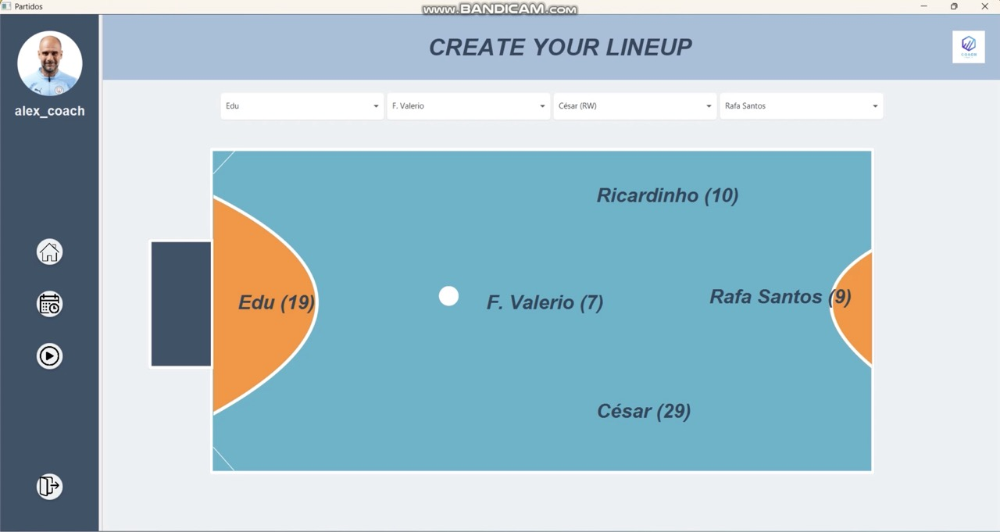

Coach-Analyst
Indoor-soccer team management and coaching  

The interface is made with JavaFX, for the backend used Hibernate and Spring, and MYSQL as a database  

(includes the .sql backup and YML file if you want to boot un a docker container)

Java – Spring – JavaFX – Gluon – Hibernate – MySQL – Git - Gluon
•	Developed a Java desktop application to manage teams with CRUD operations over 7 entities: Calendar, Match, Player, Team, Tournament, Training, User  

•	Implemented a layered architecture and used Hibernate for ORM with complex entity relationships  

•	Designed a clean UI using JavaFX and Gluon  

Some captures of the interface in JavaFX

